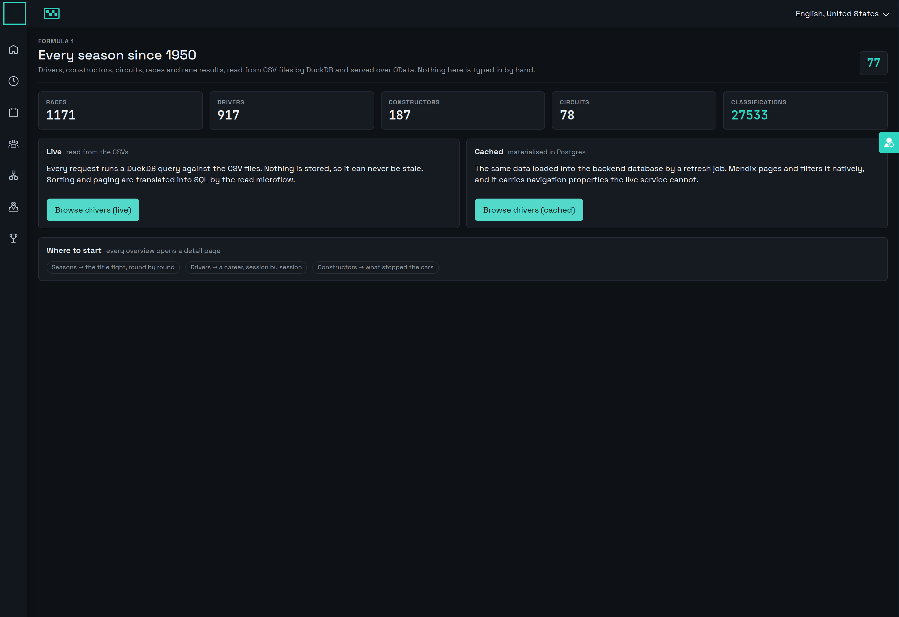
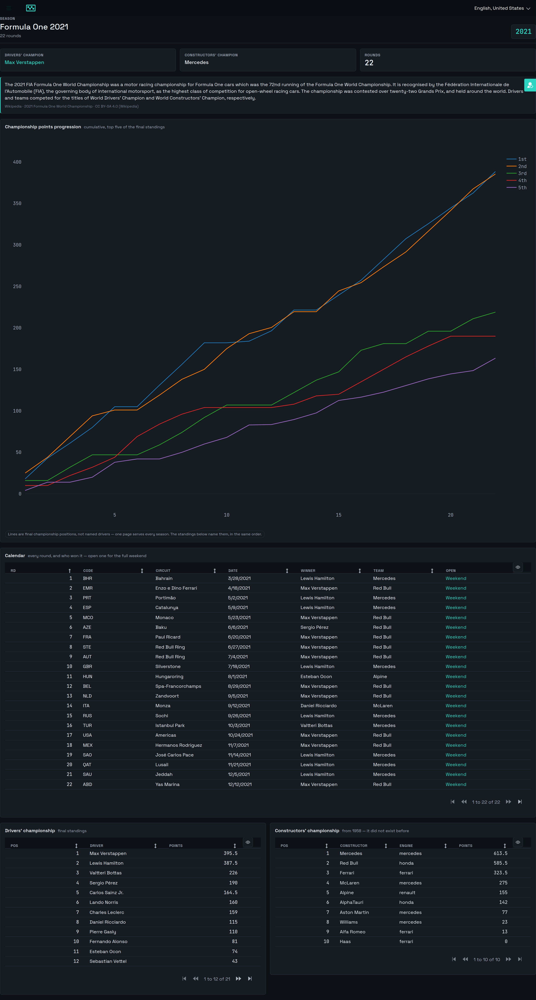
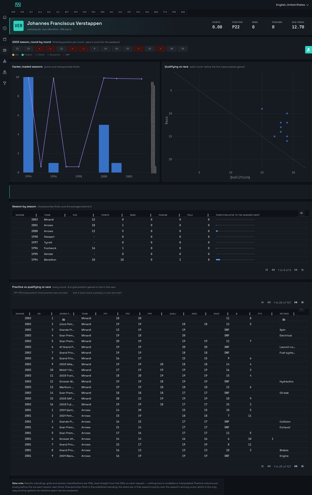
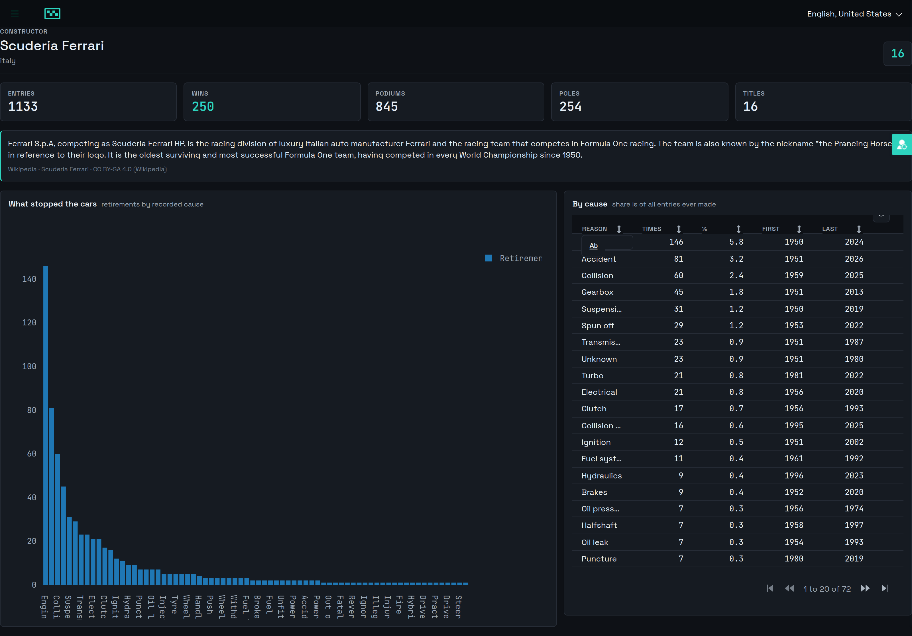
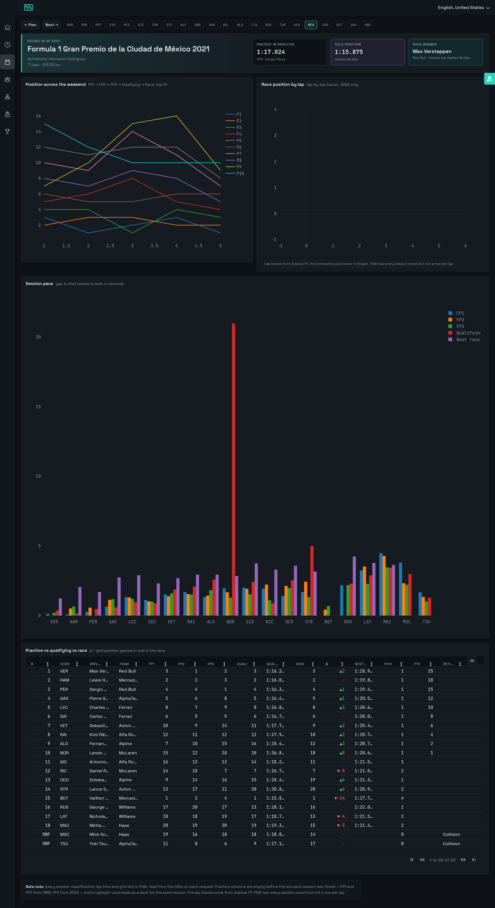
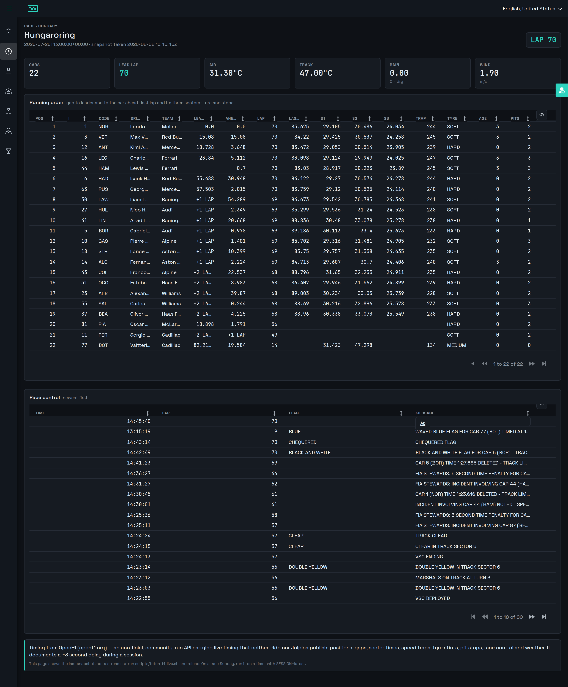
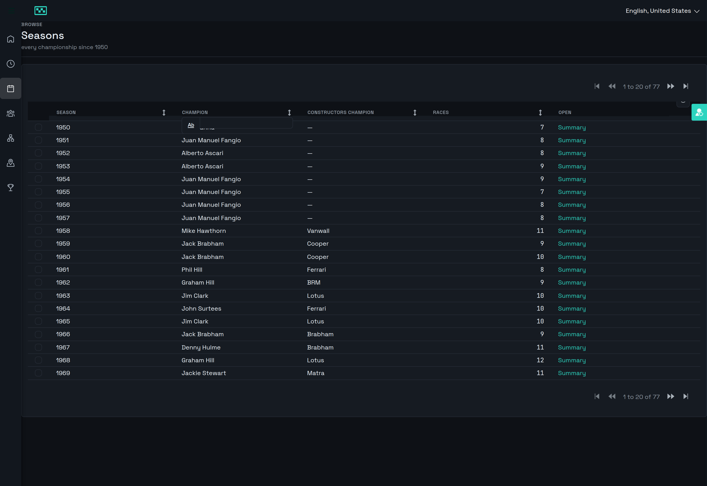
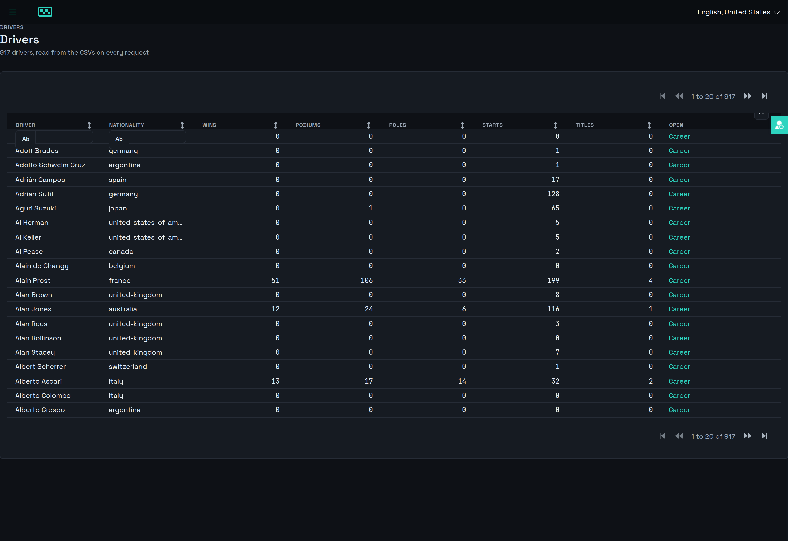
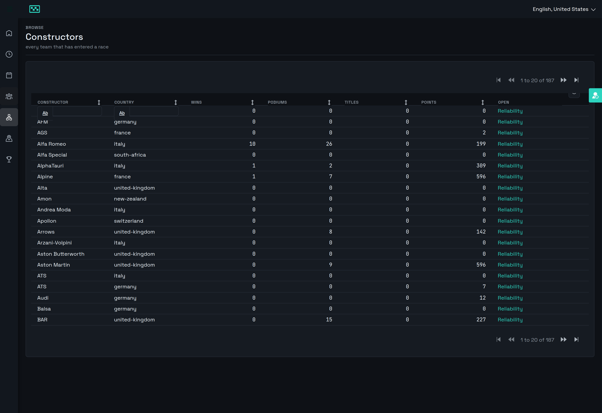
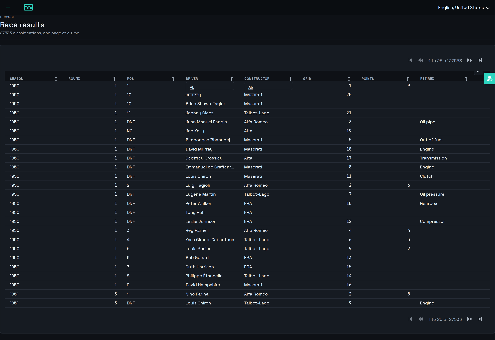

# Formula1 — historical Formula 1 data browser

A Mendix **solution**: two apps in one repo, provisioned and developed with
[mxcli](https://github.com/ako/mxcli).

## The brief

> **What it is:** a Formula 1 historical data browser.
>
> **How it is built:** online-available Formula 1 data stored as CSV in a folder;
> a Mendix backend app using the Database Connector and DuckDB to read data from
> the CSV files; a Mendix frontend app allowing users to view all available data.
>
> **What it tracks:** all historical Formula 1 data.
>
> **Who logs in:** the Formula 1 enthusiast.

Theme `console` (dark), Mendix **11.13.0**, mxcli built from **ako/mxcli main** (`c76d4b7`).

## What it looks like



Every screenshot below is the running app, captured against a live backend by
`scripts/shoot-screenshots.mjs`. They are regenerated rather than curated, so a
panel that is empty here is empty in the app.

## The two apps

| App | Port / host | Owns |
|---|---|---|
| `Formula1Backend` | `http://backend.local:8080/` (admin 8090, serve 6543) | Reading the CSVs through DuckDB over JDBC, and publishing the result as **two** OData services — see below |
| `Formula1Frontend` | `http://frontend.local:8180/` (admin 8190, serve 6643) | Consuming both services as external entities, and presenting them — the browsing UI the enthusiast uses |

Each app is a full Mendix project: its own `.mpr`, its own runtime, its own
Postgres database (`formula1backend` / `formula1frontend`, derived from the
`.mpr` name).

**Two hostnames, not just two ports.** Cookies are keyed on host name and ignore
the port, so both apps on `localhost` would share one cookie jar and silently
overwrite each other's `XASSESSIONID`. `backend.local` and `frontend.local` both
resolve to `127.0.0.1` via `/etc/hosts`; each app's `ApplicationRootUrl` names
its own host so the runtime generates absolute URLs (deep links, OIDC redirect
URIs) against the name rather than the listen address.

**How they talk.** The backend publishes **two** OData services over the same
eight resources, built two different ways, so they can be compared directly.
Wire the frontend in dependency order — the backend must be *running* when the
OData client is created, because `CREATE ODATA CLIENT` fetches `$metadata` at
that moment and caches it. The frontend's `ServiceUrl` points at a constant, not
a literal, so the address is environment-overridable.

## The three services

Two of them publish the dataset the same eight ways, so the trade-off between
reading CSVs per request and materialising them can be measured. The third,
`F1FanApi` — `/odata/f1-fan/` — publishes answers rather than tables: a driver's
career season by season, a season's title fight round by round, a team's
retirements by cause, and a sourced paragraph about any of them. Same DuckDB,
same nothing-materialised, five resources, all filtered to one driver, season or
team by `$filter`.

| | `F1LiveApi` — `/odata/f1-live/` | `F1CachedApi` — `/odata/f1/` |
|---|---|---|
| Data comes from | the CSVs, read on every request | Postgres, filled by a refresh job |
| Entities | non-persistable + a read microflow each | persistent |
| Paging | `$skip`/`$top` translated to `OFFSET`/`LIMIT` by the read microflow | `PageSize` 100 (200 for results) |
| `$filter` / `$orderby` | translated to `WHERE`/`ORDER BY` against the CSVs | pushed into SQL by Mendix |
| `$count` | works (27533 race results) | works (27533 race results) |
| Navigation properties | none — the rows are flat, DuckDB did the joins | `season`, `circuit`, `driver`, `constructor` |
| Staleness | impossible | as old as the last refresh |
| Setup cost | none | `ACT_RefreshAll`, ~33 s |

### Query pushdown

Mendix applies **no** query options to a resource backed by a read microflow — it
hands over the request and returns whatever comes back. `?$top=5` really did
return all 917 drivers. So every read microflow parses the options off the
request and answers them itself.

The part of that which is not about Formula 1 is now a standalone module:
[`ODataPushdown`](model/odatapushdown/) — one parse action turning `$filter`,
`$orderby`, `$top`, `$skip`, `$count` and the key lookup into either SQL to
splice or values to bind, across five SQL dialects. Copy two directories into
another project and it works there. Its grammar is the one Mendix's own OData
client emits, captured off the wire because
[the requirements page](https://docs.mendix.com/refguide/consumed-odata-service-requirements/)
names the query options and not one operator.

It also renders **stored routine** invocations — `SELECT * FROM f(…)`,
`CALL p(…)`, `EXEC p @x = …`, `BEGIN p(…); END;` — as bound templates, for
resources whose logic lives in the database rather than in a table. A fifth
service, `F1OpsApi`, puts a real Postgres schema's table function and procedure
behind OData to prove it (`scripts/create-f1ops-db.sh`). The procedure is a real
**OData action** — an `ActionImport` in `$metadata`, `POST` the arguments, get
the outcome back — which MDL could not declare until mxcli `715bac5` closed the
gap this repo filed. FINDINGS §47, §48.

All five services use **custom authentication**: a microflow reads a key off the
request headers, so no password is hashed per request. That deleted
`BcryptCost = 8`, a deliberate weakening taken when the proper fix could not be
expressed. FINDINGS §40, §48.

A datagrid showing rows 80–100 sorted by name:

| | before | after |
|---|---|---|
| rows | 917 | **20** |
| bytes | 293422 | **6621** |
| `@odata.count` | unsupported | **917** |
| sort order | ignored | applied in SQL |

That is also what makes `RaceResults` publishable from the CSVs at all: all 27533
rows, a page at a time, 7.6 KB per request, nothing materialised. Both services
now answer **41** for Senna's race wins — one counting rows in Postgres, the
other scanning a 4 MB CSV per request.

Column names from `$orderby` and `$filter` reach SQL, so each one is resolved
through a per-resource whitelist that also declares each column's type — Mendix
quotes a literal according to what the *widget* thinks the attribute is, so the
same numeric column arrives as `year eq 1957` from a grid header and
`year eq '1957'` from a combo box. An unlisted name is ignored in a sort and
rejected in a filter — dropping a filter would quietly return more rows than the
client asked for. `tests/pushdown.test.mdl` covers the grammar term by term, the
clamping, the key in all three spellings it arrives in, and the rejections: 49
tests, 57 across the backend.

The remaining live resources (Seasons, Circuits, Constructors, Races, both
standings) are small enough to return whole and still do; they follow the same
pattern when needed. All eight are countable.

## The frontend

Two OData clients, one per service, in their own modules — `F1Live` and
`F1Cached` — because both services publish identically named resources. 16
external entities generated from the contracts under
`Formula1Frontend/contracts/`, which are committed so the frontend model builds
with the backend down.

Verified against the running backend:

```
PASS  Live client retrieves all 917 drivers straight from the CSVs (1.072s)
PASS  Cached client retrieves all 917 drivers from Postgres          (533ms)
PASS  Live client:   Senna has 41 race wins                          (634ms)
PASS  Cached client: Senna has 41 race wins                          (421ms)
PASS  Live client:   name maps to the remote name                    (469ms)
PASS  Cached client: name maps to the remote name                    (385ms)
```

`RETRIEVE ... WHERE driverId = 'ayrton-senna'` on the live client reaches through
OData, into the read microflow, into a `read_csv()` scan and back.

See `model/frontend/README.md` — in particular, do not patch generated external
entities; fix the contract and regenerate.

**Design.** The pages follow a supplied redesign that keeps the Console palette
exactly — `#0E1116` ground, `#2DD4BF` primary, 6px radius, 28px rows, Space
Grotesk over JetBrains Mono on every number — and changes the arrangement: a
header band (eyebrow, title, subtitle, one badge), a row of tiles carrying the
numbers that used to be a sentence, then panels holding one thing each with a
muted subtitle on the title's baseline. `theme/web/_f1-layout.scss` is that
layer; every value in it resolves through a `--mxt-*` token, so it follows a
light/dark flip and a re-brand rather than pinning the look.

**Theming.** `console`, variant `auto`, so the app follows the OS. The theme maps
~60 Atlas Core variables onto its palette; the widget modules' own styling used
to be out of reach — Data Grid 2 bakes colours as Sass literals no token can
touch, including a pager caption at 1.02:1 contrast. mxcli `c76d4b7` generates
`_mxcli-widgets.scss` for exactly that, so `theme/web/_f1-widget-dark.scss` is
down to what it still misses: the filter-operator popover, and the header logo
(an ``, replaced with a mask painted from `--mxt-brand`). It sits outside
the `mxcli:theme` fence, so `mxcli theme apply` leaves it alone. FINDINGS §33, §34.

## The fan pages

Three pages, each opened from a row in an overview:

| Page | Shows |
|---|---|
| **Driver career** | Every season — teams, championship position, wins, poles, average qualifying and finishing position — then every race with its three practice sessions, qualifying, grid slot and result side by side. The practice columns are empty before timed practice was recorded, which is itself the answer to "how did they practise". |
| **Season summary** | A line chart of cumulative points round by round for the top five, computed with a DuckDB window function over the race results, plus both final standings. |
| **Constructor** | Every reason that team's cars stopped, how often, and what share of their entries it accounts for — Ferrari: 72 distinct reasons, `Engine` 146 times, 5.8% of 2515 entries, 1950 to 2024. |

Each page opens with a paragraph from Wikipedia — 224 of them, covering all 77
seasons, 116 race-winning drivers and 31 winning constructors, fetched by
`scripts/fetch-f1-facts.sh` and read by DuckDB from `data/facts/f1db-facts.csv`
like everything else. The text is CC BY-SA 4.0; the article link and licence
travel with every row and are shown on the page.

The 2021 season, its title fight as a points curve, and the calendar each round
opens from:



A career — here Jos Verstappen's, eight seasons across five teams, every round
with practice, qualifying, grid and result on one line:



And what stopped a team's cars:



## The race weekend

A fourth page, opened from any row of a season's calendar: one Grand Prix with
every session beside the next.

| Panel | From |
|---|---|
| Session cards | who led FP1, FP2, FP3, who took pole and with what lap, the fastest lap, the winner |
| Position across the weekend | FP1 → FP2 → FP3 → Quali → Race for the top ten, as ten lines over five points |
| Race position by lap | the lap-by-lap traces — the one thing f1db does not carry |
| Session pace | each driver's gap to that session's own best, in seconds, so a wet FP1 does not skew the chart |
| The table | code, team, all three practices, qualifying position and lap, grid, Δ, best lap, pit stops, points, retirement |



Bahrain 2021: Verstappen quickest in all three practices and on pole, Hamilton
winning it, Bottas taking the fastest lap. The lap-trace panel is empty because
traces are fetched for 2024 only — the panel says so rather than pretending.

**Where the lap traces come from.** f1db has every session's *result* — 17085
fastest laps back to 1950, qualifying with Q1/Q2/Q3 splits, practice from 1986,
22430 pit stops with lap and duration — but not a row per driver per lap. Ergast
had that and Ergast is gone (`ergast.com` now redirects). `scripts/fetch-f1-laps.sh`
pulls it from [Jolpica-F1](https://jolpi.ca), the community successor on the same
API shape: 26574 timings for 2024, ~12 requests per race inside a 500/hour budget,
written to `data/laps/f1db-laps.csv` and read by DuckDB like everything else.
Jolpica's driver ids are not f1db's, so the join tries the slug, then the
accent-stripped surname restricted to that race's starters.

Set `LAP_SEASONS="2023 2024"` to widen it; the default is one season because two
would exceed the hourly budget.

## Live race overview

A fourth data source and a fourth service, `F1LiveNowApi` — `/odata/f1-now/` —
carrying what neither f1db nor Jolpica publish: **live timing**.

```
Race @ Hungaroring, Budapest — lead lap 70, air 31.3°C, track 47.0°C
  P1  NOR  Lando NORRIS     McLaren          gap 0.0     S1 29.105 S2 30.486 S3 24.034  SOFT(3) 2 stops
  P2  VER  Max VERSTAPPEN   Red Bull Racing  gap 15.08   S1 29.425 S2 30.537 S3 24.258  SOFT(3) 2 stops
  P3  ANT  Kimi ANTONELLI   Mercedes         gap 18.728  S1 29.053 S2 30.514 S3 23.905  HARD(0) 2 stops
```

Running order with gap to leader and to the car ahead, last lap and its three
sectors, speed trap, tyre and age, pit stops; race-control messages newest
first; and air/track temperature, rain and wind.

Source: [OpenF1](https://openf1.org) — unofficial, free, key-less, documenting a
~3 second delay during a session. `scripts/fetch-f1-live.sh` snapshots one
session into `data/live/`; the page reads the last snapshot and **shows when it
was taken**. Re-run and reload for the next one; on a race Sunday run it on a
timer with `SESSION=latest`.



One trap: OpenF1 **404s the entire request if you pass `limit`**. Filter with
`session_key` / `driver_number` instead.

## The overviews

The four browse pages every detail page is opened from — seasons, drivers,
constructors, and all 27533 classifications with filters on driver and team:

| | |
|---|---|
|  |  |
|  |  |

## The data

`data/f1db/` — 47 CSV files, ~25 MB, covering every Formula 1 season from 1950
to the present: 1171 races, 917 drivers, 187 constructors, 78 circuits, 27533
race results, plus qualifying, practice, pit stops, fastest laps, sprint races
and season standings.

Source: [f1db/f1db](https://github.com/f1db/f1db) (CC-BY-4.0), which ships a
`f1db-csv.zip` on every release. **Not** Ergast — that service was shut down and
its domain no longer serves the dump.

The CSVs are git-ignored and re-fetched by `scripts/fetch-f1-data.sh`. The
backend never copies them into a Mendix database: DuckDB reads them in place at
query time via `read_csv()`, through the JDBC driver, behind Mendix's External
Database Connector (database type `BYOD`, connection string `jdbc:duckdb:`).

**This is proven, not assumed.** `spikes/duckdb-readpath/` holds a throwaway probe
that ran inside a booted Mendix runtime and asserted against real values — Senna 41
wins, Hamilton 106, 917 driver rows — in ~30 ms per query. Re-run it any time with
`mxcli test`; the README there has the commands.

The DuckDB JDBC driver (82 MB) is declared in the model as a managed Java
dependency; mxcli resolves it into `vendorlib/` before boot, so it is git-ignored
and needs no fetch script of its own.

## Working on it

A `SessionStart` hook (`.claude/settings.json` → `.claude/bootstrap-mxcli.sh`)
makes a fresh clone ready by itself: it builds mxcli, fetches the CSVs, adds the
hostnames, caches MxBuild + the Mendix runtime and provisions both databases.
To do it by hand:

```bash
sh .claude/bootstrap-mxcli.sh
```

For a fast test loop, leave the backend up with its test endpoint and attach to it
— ~2 s per iteration instead of a ~34 s cold boot each time:

```bash
./mxcli run --local -p Formula1Backend.mpr --test-endpoint   # terminal 1
./mxcli test tests/ -p Formula1Backend.mpr --attach          # terminal 2
```

Then boot either app:

```bash
cd Formula1Backend  && ./mxcli run --local -p Formula1Backend.mpr
cd Formula1Frontend && ./mxcli run --local -p Formula1Frontend.mpr \
    --app-port 8180 --admin-port 8190 --serve-port 6643
```

That is all it takes again. Until mxcli `b4a825e` the boot deleted the browser
client it had just built and every page came up black, so this repo carried a
wrapper script to put it back; the boot now bundles after packaging and verifies
it. FINDINGS §35, §41.

**Watching it run.** `scripts/run-observed.sh` boots both apps with the three
things a plain `run --local` leaves off, and puts them on the hub:

```bash
scripts/run-observed.sh          # both apps, observed, on $MXCLI_HUB_URL
HUB= scripts/run-observed.sh     # the same, local only
scripts/run-observed.sh stop
```

| | |
|---|---|
| Errors | `Formula1{Backend,Frontend}/.mxcli/runtime.log` — server stack traces and microflow `LOG` output. The browser only ever shows a generic dialog; this is where the cause is. |
| Metrics | `--metrics` registers a Prometheus registry: `http://127.0.0.1:8090/prometheus` (backend), `:8190` (frontend). Sessions, JVM, connection pool, request counts. |
| Traces | `--trace-otlp` attaches the OpenTelemetry agent and exports to `scripts/otlp-collector.py`, which writes one JSON object per span to `.mxcli-obs/spans.jsonl`. |

`--trace` on its own uses a console exporter that drops timestamps and parent
span ids — enough to see that a span happened, not enough for a duration or a
call tree. The collector is what keeps both, and

```bash
python3 scripts/span-report.py .mxcli-obs/spans.jsonl --since 60
```

reads it: failures first, then total self-time by span, then the slowest single
spans, then the traces worth opening. Self-time is a span's duration less its
children's — a parent at 2000ms with 3ms of its own is not the bottleneck,
something under it is. Take one of the trace ids it prints and

```bash
python3 scripts/span-report.py .mxcli-obs/spans.jsonl --trace <id>
```

prints that request as a tree, SQL statements included. A cold
`GET /odata/f1-fan/DriverSeasons` looks like this — the authentication microflow,
then the DuckDB scan that is the actual cost:

```
  866.9ms  own   38.7ms  GET /*
     12.4ms  own   1.7ms  Microflow Formula1Backend.AuthenticateApiClient
       10.7ms  own   8.0ms  Retrieve activity //System.User[Name = ?]
    810.7ms  own   1.4ms  Microflow Formula1Backend.Read_DriverSeasons
      808.1ms own 393.4ms  ExecuteDatabaseQueryAction activity
```

One caveat worth knowing before reading a report: the first thirty seconds after
boot are dominated by Mendix's own cluster-management tasks, which have nothing
to do with the app. `--since` exists for that — exercise the page, then ask what
the last sixty seconds did.

**Flame charts.** With the apps observed, walk the screens and render the spans
as flame charts:

```bash
node  scripts/walk-screens.mjs .mxcli-obs/marks.json      # drives the six screens
python3 scripts/span-flame.py .mxcli-obs/spans.jsonl \
        .mxcli-obs/marks.json flames.html \
        Formula1Frontend/theme/web/mxcli-fonts/…          # optional inlined faces
```

`marks.json` records when each screen was on screen, which is how a span is
attributed to the screen that caused it. Each screen then gets two flames, and
they answer different questions. The **timeline** is one request on real time —
x is offset from its start, so a wide frame with a narrow child was waiting. The
**merged** flame is every span the screen produced, folded by call path and
summed, so x is share of work rather than time and a query issued twenty-eight
times is twenty-eight times wider.

Both are end to end: the consumed OData client propagates trace context, so one
stack descends from the browser's `POST /xas/`, through the frontend's
`Retrieve by microflow`, across the service call, into the backend microflow and
down to the DuckDB scan. FINDINGS §52 is what the first run of this found.

**Regenerating the screenshots.** With both apps up:

```bash
node scripts/shoot-screenshots.mjs
```

It logs in as the demo user, walks every page and writes `docs/screenshots/`.
Two things to know before believing a bad-looking result: the race weekend page
needs the better part of a minute for its last chart series, and the trial
licence caps concurrent sessions — enough runs and the client 401s at startup
and pages come up empty. Clear them with

```bash
sudo -u postgres psql -d formula1frontend -c 'delete from system$session;'
```

Rendering the real pages is not decoration. It is the only check in this project
that catches a chart on a white ground, a column header reading `COLOPENWEEKEND`,
or a drill-down that opens the wrong record — none of which `check`, the build,
the runtime log or `curl` report. FINDINGS §38 lists what one pass found.

`./mxcli` is built from source rather than downloaded — see
`scripts/build-mxcli.sh` and the note in `FINDINGS.md`. Both the binary (~85 MB)
and the CSVs are git-ignored; the scripts that fetch them are committed, which
is what lets a reaped session bootstrap from files instead of from a prompt.

See `FINDINGS.md` for what broke and what was worked around.

## Where the time actually goes

`tools/observability/` traces a page turn end to end — browser → frontend →
OData → backend → DuckDB — with real durations. Steady-state, per page turn:

| | live (DuckDB/CSV) | cached (Postgres) |
|---|---|---|
| whole turn | ~500 ms | ~370 ms |
| **BCrypt auth** | **303 ms (61%)** | **301 ms (81%)** |
| DuckDB `read_csv` ×2 | 68 ms | — |
| connector overhead | 78 ms | — |
| Postgres queries | — | 3.5 ms |

The frontend's OData client used to send basic credentials and hold no session,
so the backend ran a **full BCrypt password verification on every request**. A
wrong password cost the same ~350 ms as a right one; no credentials at all cost
10 ms. That was the single biggest cost in the solution — bigger than reading a
4 MB CSV twice.

It is gone. All five services use custom authentication: a microflow reads a key
off the request headers, so there is no password to verify and no hash to
compute. The interim fix — dropping the BCrypt work factor from 12 to 8, which
is a deliberate weakening — has been reverted with it.

FINDINGS §31 has the full trace and the method; §40 and §48 the fix.
